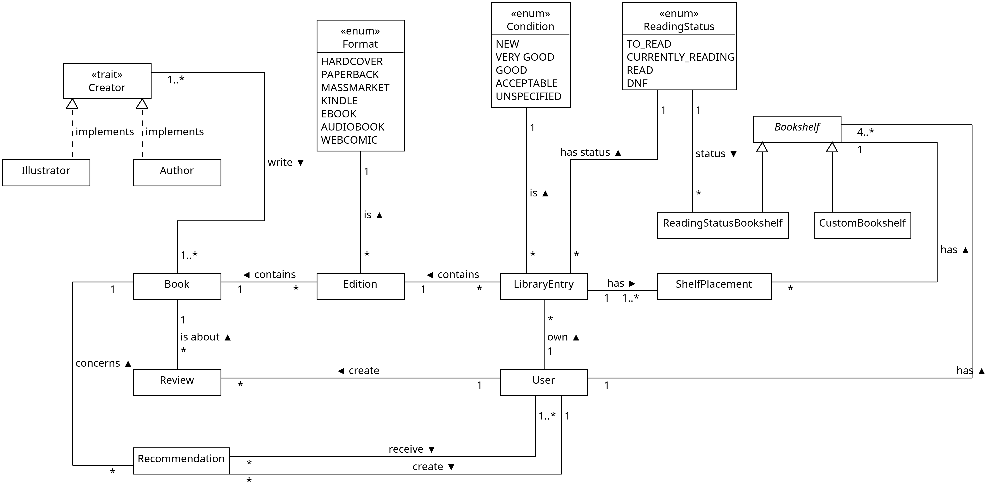
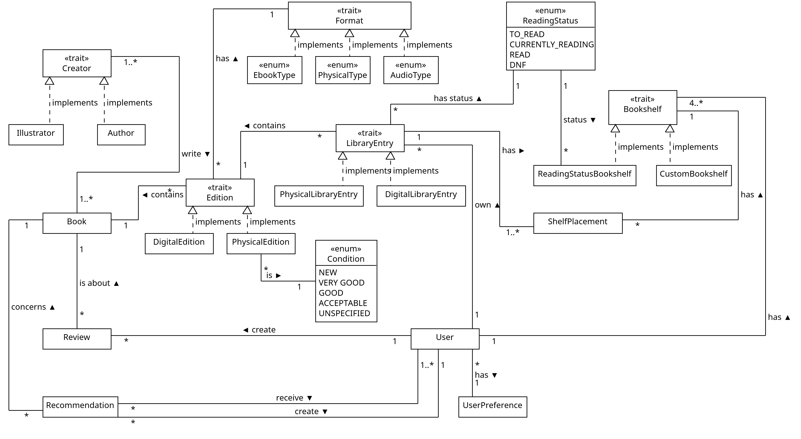

# AdvProg - Exercise 2 - Goodreads Library Modeling in Scala

## Prérequis

- Scala >= 3
- Librairie [scala-csv](https://index.scala-lang.org/tototoshi/scala-csv) pour parser le CSV d'export de Goodreads.

## Lancer le programme

Au niveau du fichier `build.sbt`, lancer la commande suivante dans le terminal:

```bash
sbt run
```

Le programme load les données du CSV dans des collections Scala et affiche dans le terminal: 100 livres de la bibliothèque de l'utilisateur, ses 3 livres préférés et tous les auteurs du système.

## Modèle de données

Le schéma ci-dessous représente les classes et les relations qui modélisent les données du CSV d'export GoodReads. C'est une vue très haut niveau qui ne contient ni les attributs ni les méthodes des classes. 

### Modèle de données à la fin du homework 2



### Modèle de données à la fin du homework 3



Les changements principaux sont:
- Transformation de l'enum `Format` en trait avec des implémentations spécifiques pour les différents formats d'édition (physique, ebook, audio).
- Transformation des classes `Edition` et `LibraryEntry` en traits implémentés différement si l'édition est physique ou digitale.
- Grâce à la meilleure distinction physique/digital, l'enum `Condition` est maintenant utilisée uniquement pour les éditions physiques, ce qui a plus de sens.
- Ajout de la classe `UserPreference` pour modéliser les préférences de lecture d'un utilisateur et de la classe `EditionMatcher` pour faire le lien entre les préférences d'un utilisateur et les éditions disponibles dans la bibliothèque. Ces ajouts ont été faits pour pouvoir donner un exemple de contravariance (consommateur d'objets).

## Choix de conception et d'implémentation

### Homework 2

- Les champs suivants du CSV n'ont pas été retenus, soit car ils sont tout le temps vides, soit car ils ne sont pas très pertinents pour la modélisation: `Author l-f`, `BCID`, `Condition Description`.
- Certains champs qui sont tout le temps vides dans le CSV ont été modélisés dans le but d'avoir une modélisation complète.
- Bien que le CSV ne contienne l'export des données d'un seul utilisateur, les utilisateurs ont été modélisés dans la classe `User` pour avoir une modélisation plus réaliste et pouvoir faire des recommandations entre utilisateurs. On admet que les champs `RecommendedFor` et `RecommendedBy` (qui sont tout le temps vides dans le CSV) contiennent des user id.
- Le champ `Exclusive Shelf` n'étant jamais vide, il a été décidé de rajouter le livre dans l'étagère qui en découle dans les cas où `Bookshelf` est vide. 
- Les auteurs et livres ne sont que ceux présents dans le CSV, ils ne sont donc pas exhaustif de tout ce qui peut être trouvé sur Goodreads. 
- Les `match` ont été préféré aux `if` si possible.
- La méthode `getOrElse` (sucre syntaxique) a été utilisée à la place de la construction avec match pour avoir un code moins verbeux.
```
foo match
    case Some(value) => value
    case None => defaultValue
```

### Homework 3

Pour apporter plus de complexité au modèle de données et pouvoir utiliser des fonctionnalités avancées de type de Scala, l'enum representant les formats d'édition a été transformée en trait, ce qui permet de faire la distinction entre les éditions physiques, ebooks et audio à travers diverses implémentations de ce trait. (Voir schéma du modèle de données à la fin du homework 3.)
- **Alias de type**: Des alias de type ont été utilisés pour `UserId`, `ISBN`, `ISBN13`, `Year`, `Date` et `Rating` pour améliorer la lisibilité du code et faciliter les modifications futures.
- **Type paramétré**: Le trait `Edition` a été transformé en type paramétré pour faire la distinction entre les éditions physiques, ebooks et audio. Cela permet d'avoir des types plus spécifiques pour chaque format d'édition tout en partageant une interface commune.
- **Type members**: Un type membre `Self <: LibraryEntry` a été utilisé dans le trait `LibraryEntry` pour permettre d'implémenter directement dans le trait les méthodes partagées par toutes les implémentations qui utilisent `copy` pour retourner une nouvelle instance du même type. Cela évite d'avoir à redéfinir ces méthodes de manière indentique dans chaque implémentation. De plus, cela permet de garder le type concret au retour des méthodes.
- **Covariance**: La covariance a été utilisée pour le trait `Edition[+F <: Format]`. Cela signifie que si `F1` est un sous-type de `F2`, alors `Edition[F1]` est un sous-type de `Edition[F2]`. Cela permet de manipuler de manière uniforme les différents types d'éditions plus spécifiques sans cast explicite.
- **Contravariance**: La contravariance a été utilisée pour le trait `EditionMatcher[-F <: Format]`. Cela signifie que si `F1` est un sous-type de `F2`, alors `EditionMatcher[F2]` est un sous-type de `EditionMatcher[F1]`. Cela permet d'utiliser un matcher plus général pour matcher des éditions plus spécifiques. La contravariance est adaptée aux "consommateurs" d'objets, ce qui est le cas ici.
- **Union de types**: Une union de type est utilisée dans `DigitalEdition` avec `EbookType | AudioType` pour indiquer que le format d'une édition digitale peut être soit un ebook, soit un audio. Cela permet de modéliser proprement sans perdre la sécurité de type ni tout rabattre sur un type trop large. (On aurait aussi pu ajouter un enum `DigitalType` dans la hiérarchie des formats, mais dans un cas aussi simple, l'union de types est plus concise et tout aussi efficace.)
- Remarque: Pour aller plus loin, on aurait aussi pu paramétrer le trait `LibraryEntry` mais la spécialisation a été faite au niveau des classes d'implémentation `PhysicalLibraryEntry` et `DigitalLibraryEntry` pour éviter de complexifier davantage le trait. Comme le projet est assez simple, il semble que cela suffit.